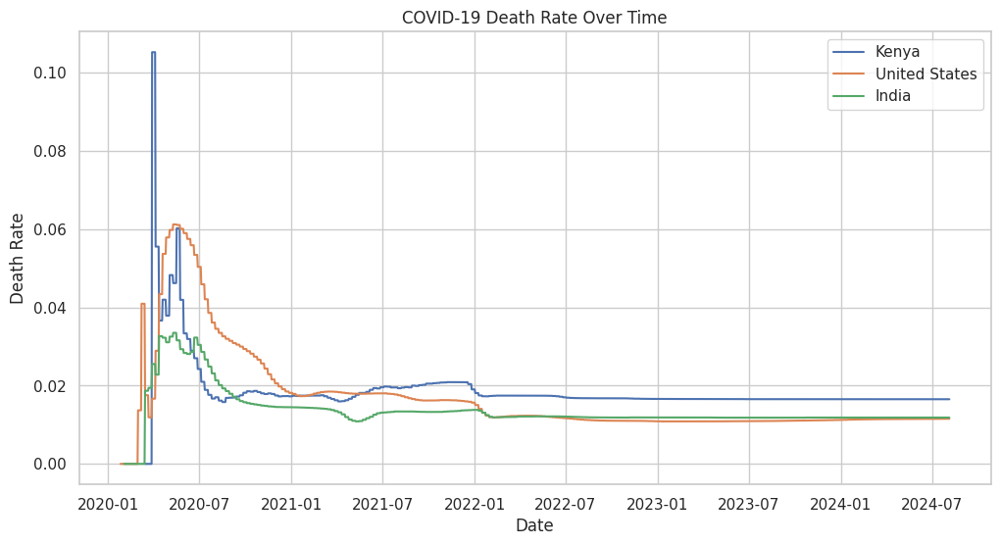

# COVID-19 Dataset Visualization Project



A Python-based data visualization project that explores and visualizes COVID-19 dataset trends using Pandas, Matplotlib, and Seaborn. This project provides insightful plots to understand patterns in COVID-19 cases, deaths, and recoveries.

## Table of Contents
- [Features](#features)
- [Installation](#installation)
- [Usage](#usage)
- [Project Structure](#project-structure)
- [Contributing](#contributing)
- [License](#license)
- [Contact](#contact)

## Features
- **Data Cleaning**: Processes raw COVID-19 data for accurate analysis.
- **Visualizations**: Generates plots like line graphs, bar charts, and heatmaps to highlight trends.
- **Key Libraries**: Utilizes Pandas for data manipulation, Matplotlib and Seaborn for plotting.
- **Jupyter Notebook**: Interactive environment for exploring and presenting the analysis.

## Installation

### Prerequisites
- Python 3.8 or higher
- Jupyter Notebook or JupyterLab
- Required Python libraries (listed below)

### Steps
1. Clone the repository:
   ```bash
   git clone https://github.com/denis-mwangi/Covid-19-dataset-visualization-Project.git
   ```
2. Navigate to the project directory:
   ```bash
   cd Covid-19-dataset-visualization-Project
   ```
3. Install dependencies using `requirements.txt` (if provided) or manually:
   ```bash
   pip install pandas matplotlib seaborn jupyter
   ```
4. Launch Jupyter Notebook:
   ```bash
   jupyter notebook
   ```
   Open `COVID_19_Visualization.ipynb` in the browser.

## Usage

1. Open the `COVID_19_Visualization.ipynb` notebook in Jupyter.
2. Run the cells sequentially to:
   - Load and clean the COVID-19 dataset.
   - Generate visualizations (e.g., time-series plots, correlation heatmaps).
3. Modify parameters (e.g., date ranges, regions) in the notebook to explore different aspects of the data.

Example visualization (from the notebook):
```python
import seaborn as sns
import matplotlib.pyplot as plt

# Example: Plotting cases over time
sns.lineplot(data=df, x='date', y='cases')
plt.title('COVID-19 Cases Over Time')
plt.show()
```

## Project Structure
```
Covid-19-dataset-visualization-Project/
├── COVID_19_Visualization.ipynb  # Main Jupyter Notebook with analysis and visualizations
├── README.md                    # Project documentation
```

*Note*: The dataset is assumed to be loaded within the notebook (e.g., via a URL or local file). Ensure the dataset is accessible before running the notebook.

## Contributing

Contributions are welcome! To contribute:
1. Fork the repository.
2. Create a feature branch (`git checkout -b feature/new-visualization`).
3. Commit your changes (`git commit -m 'Add new visualization type'`).
4. Push to the branch (`git push origin feature/new-visualization`).
5. Open a Pull Request.

Please include a description of your changes and ensure code follows PEP 8 style guidelines.

## License

This project is licensed under the [MIT License](LICENSE) - see the [LICENSE](LICENSE) file for details. *Note*: If no LICENSE file exists, consider adding one to clarify usage terms.

## Contact

- **Maintainer**: Denis Mwangi ([GitHub](https://github.com/denis-mwangi))
- **Issues**: Report bugs or suggest enhancements on the [Issues page](https://github.com/denis-mwangi/Covid-19-dataset-visualization-Project/issues).

---

⭐ Enjoyed this project? Give it a star on GitHub!
